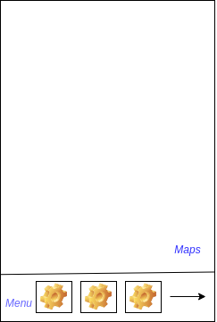
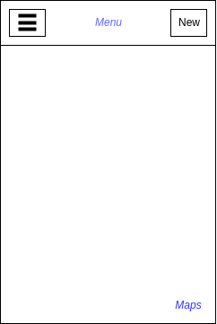
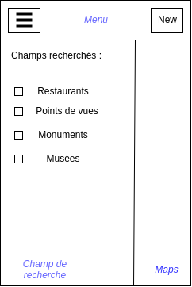

# Spécificité de l'application

## Visuel
### Écran principal

- Vue Google maps centrer sur l'utilisateur.
- Une barre de menu bloquée sur le bas de l'écan. Cette barre, scrolable contient un bouton pour chaque catégorie de point d'intérêt. Ainsi qu'un bouton pour en ajouter un nouveau. Dans cet état, on ne peut afficher qu'un seule catégorie à la fois.

### Ajout d'un point d'intérêt
Le bouton d'ajout d'un point permet de passer sur une vue avec une formulaire simple contenant les 16 champs potentiellement remplissables.

### Point spécifique
Lorsque clique sur un des marqeur, une fenêtre s'ouvre en superposition de la page principale, et affiche les données du point.

### Amélioration
Si le temps le permet, amélioration du visuel :
- Disparition de la barre fixe "Menu"
- Nouvelle barre de menu fixé sur le haut de l'écran. Elle contient deux boutons :
    - Le premier, sur la gauche, permet de faire apparaître une fenêtre avec des checkbox, elles-mêmes permettant de choisir les catégories à faire apparaitre.
    - Le second, sur la droite, permet l'ajout de nouveau point.

    
    

## Catégories

- HEBERGEMENT_LOCATIF
- PATRIMOINE_CULTUREL
- RESTAURATION
- COMMERCE_ET_SERVICE
- EQUIPEMENT
- HOTELLERIE
- DEGUSTATION
- HOTELLERIE_PLEIN_AIR
- HEBERGEMENT_COLLECTIF
- PATRIMOINE_NATUREL